<!-- Please do not change this logo with link -->

# TinyUSB Integration Project With PIC32CM GC Microcontroller
This project, which uses the Microchip Microchip MPLAB® X or MPLAB Extensions for VS Code, demonstrates the TinyUSB stack with integrated USB device examples running on top of the PIC32CM GC. Within the project, there are different configurations for different USB device class functions respectively. For example, the `device_cdc_msc` configuration is a USB CDC+MSC composite device example. The `device_hid_composite` configuration is a USB HID composite device example. The `pic32cm_gc_cpro` configuration without a USB stack involved is only for adding or removing necessary driver components from MPLAB® X MCC, which can be used by other configurations inside this same project.

## About TinyUSB
TinyUSB is an open-source cross-platform USB Host/Device stack for embedded systems, designed to be memory-safe with no dynamic allocation; and thread-safe with all interrupt events deferred then handled in the non-ISR (Interrupt Service Routine) task function. Refer to the following links for more details:
- https://docs.tinyusb.org/en/latest/
- https://github.com/hathach/tinyusb 

## Related Documentation
- [PIC32CM GC Product Page](https://www.microchip.com/en-us/product/PIC32CM5112GC00100)
- [TinyUSB Using PIC32CM GC](https://github.com/microchip-pic-avr-solutions/pic32cm_gc_cpro_tinyusb.git)

## Software Used
- [MPLAB® X IDE 6.25](https://www.microchip.com/en-us/tools-resources/develop/mplab-x-ide) or newer
- [MPLAB® XC32 4.60](https://www.microchip.com/en-us/tools-resources/develop/mplab-xc-compilers/xc32) or newer compiler
- [MPLAB® Code Configurator (MCC) 5.6.2](https://www.microchip.com/en-us/tools-resources/configure/mplab-code-configurator) plug-in or newer
- [TinyUSB Stack 0.18.0](https://github.com/hathach/tinyusb) 

## Hardware Used
- [PIC32CM GC Curiosity Pro Development Kit (EA36K74A)](https://www.microchip.com/en-us/development-tool/EA36K74A)
    

## Setup

### Physical Setup
The PIC32CM GC Curiosity Pro Development board has two USB ports. One debugger port for programming the device through the on-board debugger and one target port directly connected to the PIC32CM GC. This example uses the Debugger port for programming. After the device is programmed, the Debugger port can be disconnected and the target port must be connected to the host for TinyUSB demonstration.

### MCC Project Setup
This section explains how to set up the example in MPLAB using the MCC. The following figure presents an overview of the complete MCC setup.

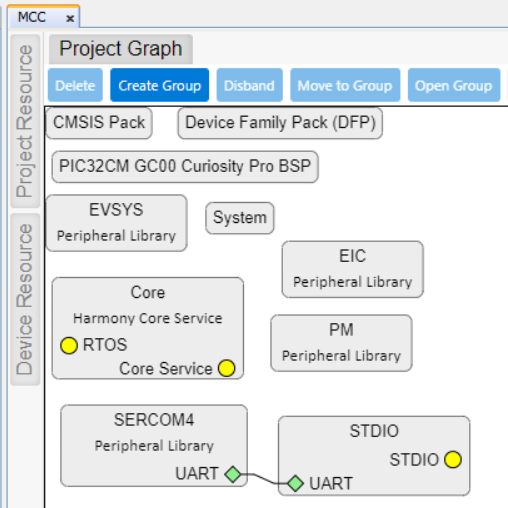

<b>Note:</b> The MCC code generation is only manually tested with the MPLAB® X MCC plug-in. The MCC within the MPLAB Extension is not tested, while building and debugging are manually tested and are working well.

## Download the PIC32CM TinyUSB Project
- Download the zip package or clone the project to get the source code

    [PIC32CM GC TinyUSB project in Github](https://github.com/microchip-pic-avr-solutions/pic32cm_gc_cpro_tinyusb.git)

## Programming and Running the PIC32CM Application
This project has two configurations with a USB function, where each configuration will demonstrate a class example: one is the MSC+CDC USB device demonstration, and the other is the HID composite USB device demonstration.

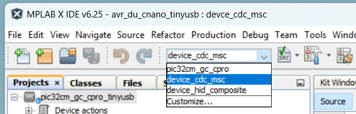

The following steps will demonstrate how to use MPLAB® X to program and run the board.

<b>Note:</b> This project can be opened, programmed, and debugged from the VS Code with MPLAB Extensions. The VS Code project is under the .X folder: pic32cm_gc_cpro_tinyusb.X. For more details on how to use the MPLAB Extensions with VS Code, refer to the [MPLAB® Tools for VS Code®](https://www.microchip.com/en-us/tools-resources/develop/mplab-extensions-vs-code).

### Running the MSC_CDC Device Demonstration
1. Connect the board to the PC through the J600: DEBUG USB.
2. Open the MPLAB® X project and select the `device_cdc_msc` configuration in project.
    
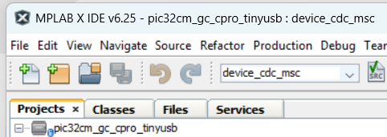

3. Build the project and program the board, by clicking the icon.
    
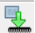

    `Programming/Verify complete` will appear after correctly programming.
    
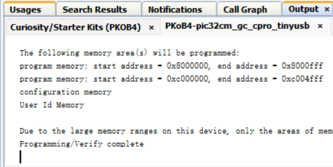

4. Connect the board's USB target port, J200, to the host PC.
5. Check the disk from the PC, `TinyUSB MSC` and `README.txt` will be displayed.
    
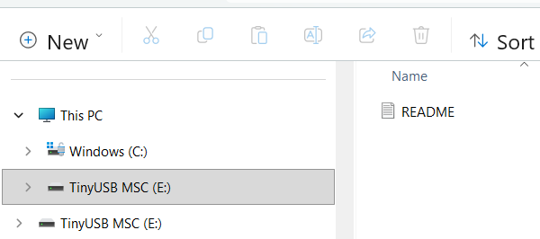

6. Open the `Device Manager` to check the COM port device.
    
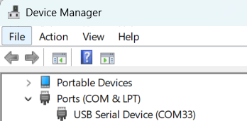

7. Open a serial terminal to test the CDC port, any typed characters will be echoed back to the terminal, as shown in the following figure.
    
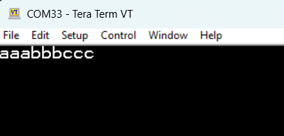

### Running the HID Composite Device Demonstration
1. Connect the board to the PC through the J600: DEBUG USB.
2. Open the MPLAB® X project and select the `device_hid_composite` configuration in the project.
    
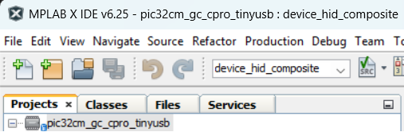

3. Build the project and program the board, by clicking the icon. 
    

    
    `Programming/Verify complete` will appear after correctly programming.
    

4. Connect the board's USB target port, J200, to the host PC.
5. Open the `Device Manager` to check if `HID Keyboard Device`  and `HID-Compliant mouse`  are present or not.
    
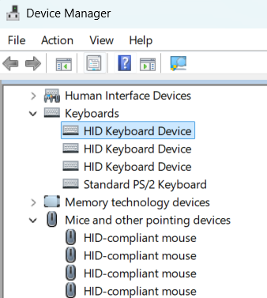

6. Open an editor from the host PC and push the **SW0** button on board. The `a`  will be typed in after every button press, meanwhile the cursor will move right and down by one step respectively.
    
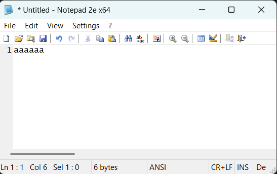

## Limitations
1. The VS Code project can only work for XC32 v5.0 or newer. The older version of XC32 cannot find the correct `elf` files for hex conversions. 
2. The current release (v1.0.0) is well tested with a bus powered device. The self-powered mechanism will be covered in a future release.
